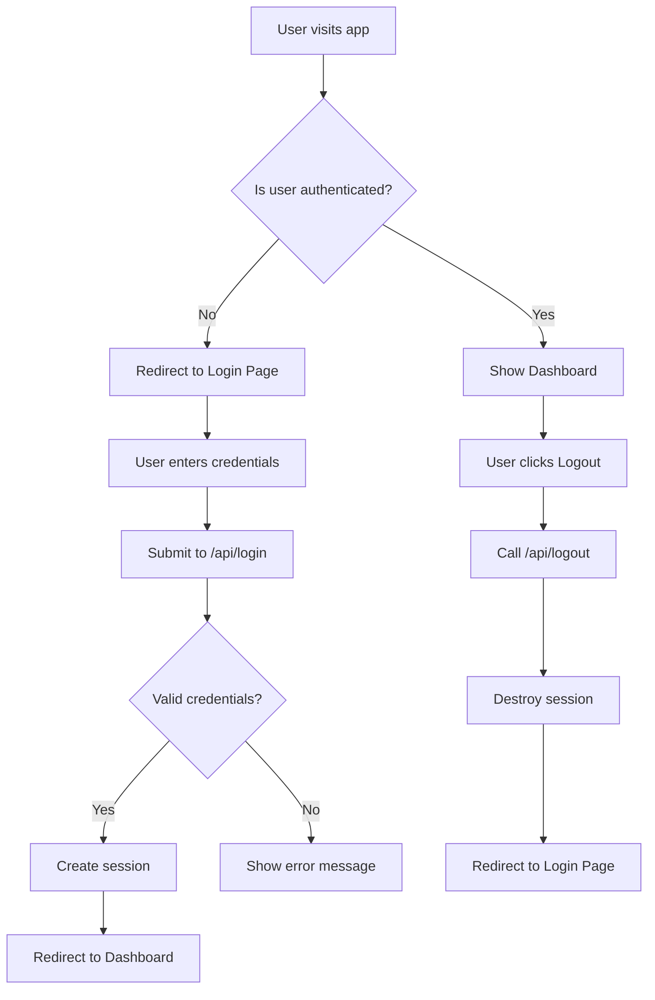

# Authentication Implementation Plan

## Overview

This document outlines the implementation plan for adding authentication and session management to the React and Express application. The solution will include session-based authentication with support for multiple user roles (admin and regular users).

## Architecture Diagram



## Backend Implementation

### 1. User Model

Create a User model with the following fields:

- id (integer, primary key, auto increment)
- username (string, unique, not null)
- email (string, unique, not null)
- password (string, not null) - hashed password
- role (enum: 'admin', 'user', default: 'user')
- created_at (date, default: current timestamp)
- updated_at (date, default: current timestamp)

### 2. Session Management

Set up session management using:

- express-session for session handling
- connect-session-sequelize for storing sessions in the database
- Secure session configuration (secure cookies, HTTP only, etc.)

### 3. Authentication Middleware

Create middleware functions to:

- Check if user is authenticated
- Check user roles for access control
- Handle unauthorized access

### 4. API Endpoints

Implement the following API endpoints:

- POST /api/login - Authenticate user and create session
- POST /api/logout - Destroy session
- GET /api/user - Get current user information
- POST /api/register - Register new users (admin only)

## Frontend Implementation

### 1. Login Page Component

Create a polished login page with:

- Username/email field
- Password field
- Login button
- Error message display
- Loading state
- Branding elements

### 2. Authentication Service

Implement an authentication service with:

- Login function
- Logout function
- Get current user function
- Session management

### 3. Route Protection

Add route protection to:

- Redirect unauthenticated users to login page
- Show appropriate content based on user roles
- Handle session expiration

### 4. User Context

Create a React context for managing user state across the application.

## Security Considerations

- Password hashing with bcrypt
- Secure session configuration
- CSRF protection
- Rate limiting on login attempts
- HTTPS in production
- Input validation and sanitization

## Implementation Steps

1. Create User model in database
2. Set up session management with express-session
3. Create authentication middleware
4. Implement login/logout API endpoints
5. Create login page component
6. Implement frontend authentication service
7. Add route protection in frontend
8. Implement user role-based access control
9. Add logout functionality
10. Test complete authentication flow

## Dependencies to Install

### Backend

```bash
npm install express-session connect-session-sequelize bcrypt jsonwebtoken
```

### Frontend

```bash
npm install react-router-dom
```

## File Structure

```
server/
├── models/
│   └── user_model.js
├── middleware/
│   └── auth_middleware.js
├── routes/
│   └── auth_route.js
├── controllers/
│   └── auth_controller.js
└── index.js (updated)

client/
├── src/
│   ├── components/
│   │   └── Login.tsx
│   ├── services/
│   │   └── authService.ts
│   ├── contexts/
│   │   └── AuthContext.tsx
│   └── App.tsx (updated)
```

## Testing Plan

1. Test successful login with valid credentials
2. Test login failure with invalid credentials
3. Test session persistence across page refreshes
4. Test logout functionality
5. Test role-based access control
6. Test session timeout
7. Test concurrent sessions

This plan provides a comprehensive approach to implementing authentication in the application while maintaining security best practices.
